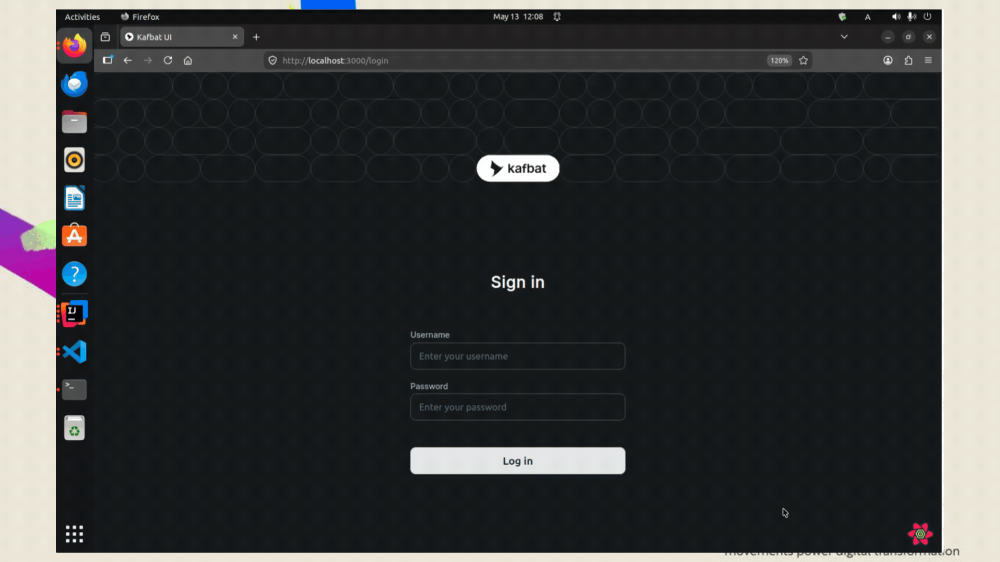
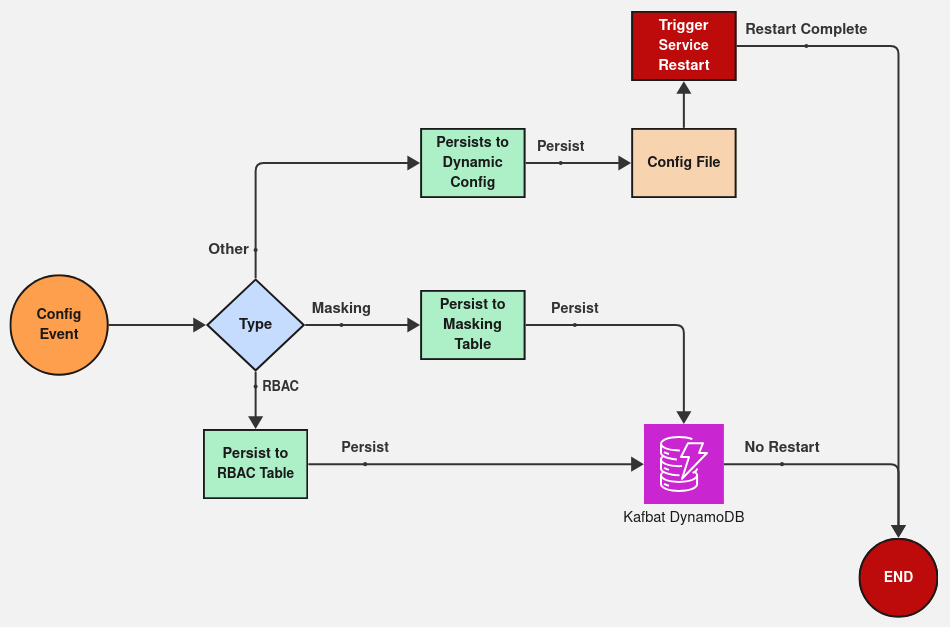

# Kafbat UI - Sainsburys Custom Data Masking
Web UI for managing Apache Kafka clusters

[Data Masking Solution Design](https://sainsburys-tech.atlassian.net/wiki/spaces/INTEGRATION/pages/1790574757)

# Interface


## Table of contents
- [Requirements](#requirements)
- [Getting started](#getting-started)
- [Design](#design)
- [Links](#links)


## Requirements
- [docker](https://www.docker.com/get-started) (required to run [Initialize application](#initialize-application))
- [dynamo](https://sainsburys-tech.atlassian.net/wiki/x/FRYgOg) (required to run [config storage](#config-storage))

## Getting Started
This feature decouples legacy kafbat masking as well as rbac config from internal config manager into a standalone real-time, no downtime data masking as well as unmasking capabilities.

using localstack aws:

create masking table
```sh
aws dynamodb create-table --table-name sainsburys-kafbat-masking --attribute-definitions AttributeName=partitionKey,AttributeType=S --key-schema AttributeName=partitionKey,KeyType=HASH     --provisioned-throughput ReadCapacityUnits=5,WriteCapacityUnits=5 --endpoint-url http://localhost:4566

```

create rbac table
```sh
aws dynamodb create-table --table-name sainsburys-kafbat-rbac --attribute-definitions AttributeName=partitionKey,AttributeType=S --key-schema AttributeName=partitionKey,KeyType=HASH     --provisioned-throughput ReadCapacityUnits=5,WriteCapacityUnits=5 --endpoint-url http://localhost:4566

```

## Config Storage
- RBAC table - sainsburys-kafbat-rbac
- Masking table - sainsburys-kafbat-masking

## Design
This design highlights the high level integration of DynamoDB component from a configuration event to commit to the new DynamoDB tables based on the config type.


## Links
[Data Masking Solution Design](https://sainsburys-tech.atlassian.net/wiki/spaces/INTEGRATION/pages/1790574757)
[LocalStack and DynamoDB](https://sainsburys-tech.atlassian.net/wiki/x/FRYgOg)